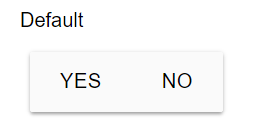
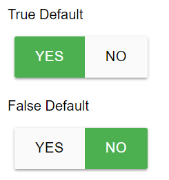
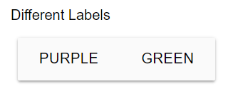

# Boolean
A simple Yes / No input.

## Properties

|   Property  |   Type  |                    Description                    |
|:-----------:|:-------:|:-------------------------------------------------:|
|    label    |  String |  The text to display above the boolean selection. |
|   default?  | Boolean |    The default selected value. (Default: None)    |
|  trueValue? |  String |  The label of the true button. (Default: "True")  |
| falseValue? |  String | The label of the false button. (Default: "False") |

## Usage
An example form with a boolean component.
```json
// forms/example.json

{
    "$schema": "../form-schema.json",
    "id": "example",
    "name": "Example Form",
    "description": "Starter Example Form",
    "items": [
        {
            "type": "boolean",
            "label": "Did the robot climb?",
            "default": false,
            "trueValue": "Yes",
            "falseValue": "No"
        }
    ]
}
```

## Images



