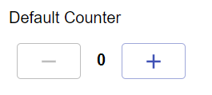

# Counter
A number with two buttons to increase it's value, and decrease. Great for counting and simple number input.

## Properties

| Property |  Type  |                                 Description                                |
|:--------:|:------:|:--------------------------------------------------------------------------:|
|   label  | String |                     The text display above the counter.                    |
| default? | Number |              The number to start the counter at. (Default: 0)              |
|   min?   | Number |       The minimum number the counter can count down to. (Default: 0)       |
|   max?   | Number |    The maximum number the counter can count up to. (Default: No limit.)    |
|   step?  | Number | The number to increase or decrease the count by when changed. (Default: 1) |

## Usage
An example form with a number input.
```json
// forms/example.json

{
    "$schema": "../form-schema.json",
    "id": "example",
    "name": "Example Form",
    "description": "Starter Example Form",
    "items": [
        {
            "type": "counter",
            "label": "Power Cubes Scored"
        }
    ]
}
```

## Images

