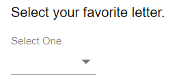
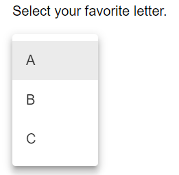
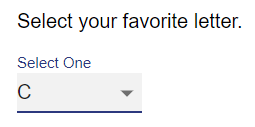

# Dropdown
A list of items, selectable by a dropdown. Only one is selectable.

## Properties

| Property |  Type  |                           Description                          |
|:--------:|:------:|:--------------------------------------------------------------:|
|   label  | String |            The text to display above the selection.            |
|  options |  Array |    An array of strings representing each possible selection.   |
| default? | Number | The index of the default selected radio input. (Default: None) |

## Usage
An example form with a dropdown component.
```json
// forms/example.json

{
    "$schema": "../form-schema.json",
    "id": "example",
    "name": "Example Form",
    "description": "Starter Example Form",
    "items": [
        {
            "type": "dropdown",
            "label": "Select your favorite letter.?",
            "options": [
                "A",
                "B",
                "C"
            ]
        }
    ]
}
```

## Images



