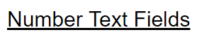

# Header
Large text used for seperating and organizing form components.

## Properties

|   Property   |  Type  |                            Description                            |
|:------------:|:------:|:-----------------------------------------------------------------:|
|     label    | String |                          The header text.                         |
| description? | String | The text below the header. Commonly used to describe the section. |

## Usage
An example form with a number input.
```json
// forms/example.json

{
    "$schema": "../form-schema.json",
    "id": "example",
    "name": "Example Form",
    "description": "Starter Example Form",
    "items": [
        {
            "type": "header",
            "label": "End Game",
            "description": "Things fill out after the match."
        },
        {
            "type": "boolean",
            "label": "Did the robot climb?"
        }
    ]
}
```

## Images

