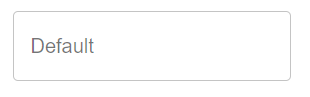

# Text
A small text field for entering short amount text. For larger amounts of text, use [Text Area](components/text-area.md).


## Properties

|   Property  |  Type  |                               Description                               |
|:-----------:|:------:|:-----------------------------------------------------------------------:|
|    label    | String |                   The text to display on the textbox.                   |
| helperText? | String | The text to display below the textbox to help users know what to enter. |

## Usage
An example form with two text boxes.
```json
// forms/example.json

{
    "$schema": "../form-schema.json",
    "id": "example",
    "name": "Example Form",
    "description": "Starter Example Form",
    "items": [
        {
            "type": "text",
            "label": "A thing"
        },
        {
            "type": "text",
            "label": "Another thing"
        }
    ]
}
```

## Images

