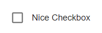

# Checkbox
A checkbox, with a label to determine a yes or no value to a question. Use multiple of these fields.

## Properties

| Property |   Type  |                          Description                         |
|:--------:|:-------:|:------------------------------------------------------------:|
|   label  |  String |       The text to display above the boolean selection.       |
|  default | Boolean | Determines whether or not the checkbox should start checked. |

## Usage
An example form with a checkbox fields.
```json
// forms/example.json

{
    "$schema": "../form-schema.json",
    "id": "example",
    "name": "Example Form",
    "description": "Starter Example Form",
    "items": [
        {
            "type": "header",
            "label": "Select everything the robot did."
        },
        {
            "type": "checkbox",
            "label": "It crossed the line."
        },
        {
            "type": "checkbox",
            "label": "It crossed did cubesx."
        }
    ]
}
```

## Images


