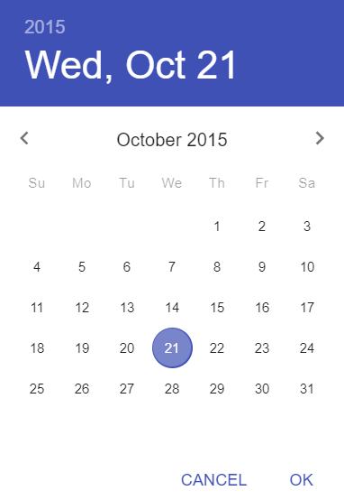
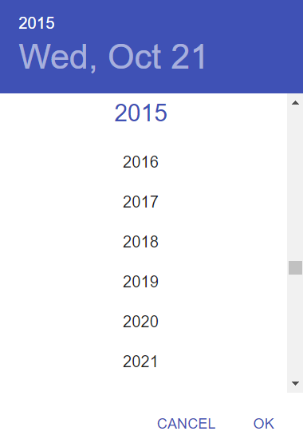
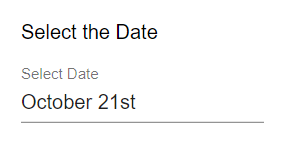

# Date
A simple field for selecting the date.

## Properties

| Property |  Type  |               Description               |
|:--------:|:------:|:---------------------------------------:|
|   label  | String | The text display above the date picker. |
| exportLabel? |  String | A short description which will be used when the form is exported or viewed in a table. |

## Usage
```json
// forms/example.json

{
    "$schema": "../form-schema.json",
    "id": "example",
    "name": "Example Form",
    "description": "Starter Example Form",
    "items": [
        {
            "type": "date",
            "label": "Select the Date"
        }
    ]
}
```

# Images




