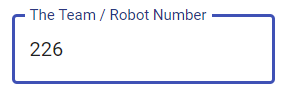
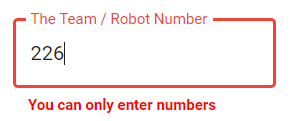
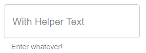
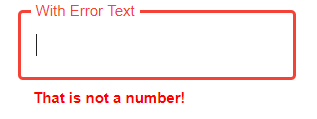

# Number
A text area which only accepts numbers.

## Properties


|   Property  |  Type  |                               Description                               |
|:-----------:|:------:|:-----------------------------------------------------------------------:|
|    label    | String |                   The text to display on the textbox.                   |
| helperText? | String | The text to display below the textbox to help users know what to enter. |
|  errorText? | String | The text to display when the user enters a non-number character.        |
| exportLabel? |  String | A short description which will be used when the form is exported or viewed in a table. |

## Usage
An example form with a number input.
```json
// forms/example.json

{
    "$schema": "../form-schema.json",
    "id": "example",
    "name": "Example Form",
    "description": "Starter Example Form",
    "items": [
        {
            "type": "number",
            "label": "The Team / Robot Number"
        }
    ]
}
```

## Images




