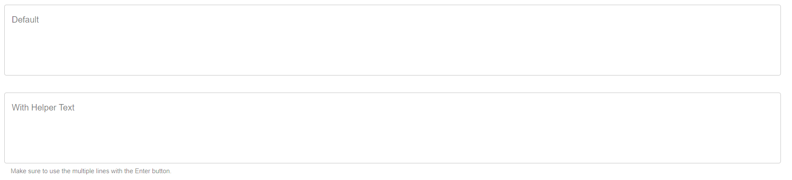

# Text Area
A text field made for large sums of text. Text field automatically expands in size as you type. 


## Properties

|   Property  |  Type  |                               Description                               |
|:-----------:|:------:|:-----------------------------------------------------------------------:|
|    label    | String |                   The text to display on the textbox.                   |
| helperText? | String | The text to display below the textbox to help users know what to enter. |

## Usage
An example form with two text boxes.
```json
// forms/example.json

{
    "$schema": "../form-schema.json",
    "id": "example",
    "name": "Example Form",
    "description": "Starter Example Form",
    "items": [
        {
            "type": "text-area",
            "label": "Other notes."
        }
    ]
}
```

## Images

